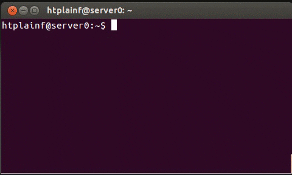

# SHELL PROJECT - A BASIC SHELL "RE-CREATION"



### Objectives
- This project was developed for learning purpose.
- Recreate a command interpreter. Shells are designed to facilitate the way in which the different programs available on the computer are invoked or executed.

### files contained in the project:

| File | Description |
| ------ | ------ |
| main.c | contain the main function that excute the shell. |
| find_commands.c | Contain functions to executes the given command. |
| recognize_command.c | Cotain functions that cut the command and pass it to checker and print error when if exits. |
| shell.h | This is a static library containing prototypes and directives. |
| strings_utilities.c | Cotains functions to compare strings, know the lengh of strings, copy the strings. |
| utilities.c | Cotains functions to allocate the necesarry bytes in memory and break it free. |
| man_1_simple_shell | This is our function manual v.0.0.1. |

## Compilate and run tests

You can use any of the ```main.c``` found in the [test](./test) folder.

Files are compiled this way:

```
$ gcc -Wall -Wno-format -Werror -Wextra -pedantic *.c
$ ./a.out
```
## Examples
```
$ ls
a.out           img     man_1_simple_shell  README.md       shell.h            utilities.c    find_commands.c   main.c   printers.c      recognize_command.c  strings_utilities.c
```
---------------------------------------------------
```
$ls -l
total 60
-rwxrwxr-x 1 vagrant vagrant 18583 Apr 14 18:24 a.out
-rw-rw-r-- 1 vagrant vagrant  3266 Apr 14 17:31 find_commands.c
drwxrwxr-x 2 vagrant vagrant  4096 Apr 14 18:08 img
-rw-rw-r-- 1 vagrant vagrant  1082 Apr 14 17:31 main.c
-rw-rw-r-- 1 vagrant vagrant  3093 Apr 14 14:37 man_1_simple_shell
-rw-rw-r-- 1 vagrant vagrant  1431 Apr 14 18:20 printers.c
-rw-rw-r-- 1 vagrant vagrant  1417 Apr 14 18:10 README.md
-rw-rw-r-- 1 vagrant vagrant  3020 Apr 14 18:21 recognize_command.c
-rw-rw-r-- 1 vagrant vagrant  1655 Apr 14 17:31 shell.h
-rw-rw-r-- 1 vagrant vagrant  1337 Apr 14 18:23 strings_utilities.c
-rw-rw-r-- 1 vagrant vagrant  2315 Apr 14 17:31 utilities.c
```
---------------------------------------------------
```
$ env
XDG_SESSION_ID=2
TERM=xterm-256color
SHELL=/bin/bash
SSH_CLIENT=10.0.2.2 53678 22
SSH_TTY=/dev/pts/0
USER=vagrant
MAIL=/var/mail/vagrant
PATH=/home/vagrant/bin:/usr/local/sbin:/usr/local/bin:/usr/sbin:/usr/bin:/sbin:/bin:/usr/games:/usr/local/games
PWD=/home/vagrant/simple_shell
LANG=en_US.UTF-8
SHLVL=1
HOME=/home/vagrant
LOGNAME=vagrant
SSH_CONNECTION=10.0.2.2 53678 10.0.2.15 22
XDG_RUNTIME_DIR=/run/user/1000
_=./a.out
OLDPWD=/home/vagrant
```

### Authors
- Yoyman Castellar - [Github](https://github.com/ymcastellar) , [Twitter](https://twitter.com/castellaryoyman).
- Elkin Mejia - [Github](https://github.com/ElkinAMG) , [Twitter](https://twitter.com/ElkinAMG).


###  End of README.md
